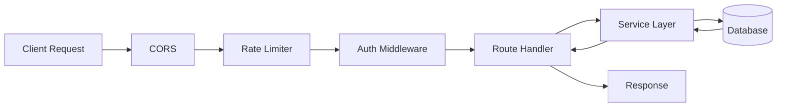

# Elysia.js Backend

TurboStack uses **Elysia.js** - a high-performance TypeScript web framework optimized for Bun runtime.

<Frame>

</Frame>

---

## Key Features

<CardGroup cols={2}>
  <Card title="Type Safety" icon="shield-check">
    End-to-end type inference from routes to response
  </Card>
  <Card title="Blazing Fast" icon="bolt">
    Built for Bun runtime with exceptional performance
  </Card>
  <Card title="OpenAPI" icon="book">
    Auto-generated Swagger documentation
  </Card>
  <Card title="Validation" icon="check-double">
    Built-in request validation with TypeBox
  </Card>
</CardGroup>

---

## Directory Structure

```
apps/api/
├── src/
│   ├── index.ts           # App entry point & middleware
│   ├── routes/
│   │   ├── auth.ts        # Authentication endpoints
│   │   ├── users.ts       # User management
│   │   ├── polar.ts       # Payment endpoints
│   │   ├── health.ts      # Health checks
│   │   └── webhooks.ts    # Webhook handlers
│   ├── services/
│   │   ├── auth.service.ts    # Auth business logic
│   │   ├── email.service.tsx  # Email sending (React Email)
│   │   └── polar.service.ts   # Payment logic
│   ├── middleware/
│   │   └── auth.ts        # JWT verification
│   └── emails/
│       └── templates/     # React Email templates
├── tsconfig.json
└── package.json
```

---

## Main Entry Point

The API is configured with essential middleware:

<Tabs>
  <Tab title="CORS & Rate Limit" icon="shield">
    ```typescript
    import { Elysia } from "elysia";
    import { cors } from "@elysiajs/cors";
    import { rateLimit } from "elysia-rate-limit";

    const app = new Elysia()
      // CORS for frontend access
      .use(cors({
        origin: process.env.CORS_ORIGIN || "http://localhost:4100",
        credentials: true,
      }))
      // Rate limiting: 100 requests/minute
      .use(rateLimit({
        duration: 60 * 1000,
        max: 100,
        errorResponse: new Response(
          JSON.stringify({
            success: false,
            error: "Too Many Requests",
          }),
          { status: 429 }
        ),
      }));
    ```

  </Tab>
  <Tab title="OpenAPI/Swagger" icon="book">
    ```typescript
    import { openapi } from "@elysiajs/openapi";

    app.use(openapi({
      documentation: {
        info: {
          title: "TurboStack API",
          version: "1.0.0",
          description: "TurboStack API with JWT authentication",
        },
        tags: [
          { name: "Health", description: "Health check endpoints" },
          { name: "Auth", description: "Authentication endpoints" },
          { name: "Users", description: "User management" },
          { name: "Polar", description: "Payments" },
        ],
        components: {
          securitySchemes: {
            bearerAuth: {
              type: "http",
              scheme: "bearer",
              bearerFormat: "JWT",
            },
          },
        },
      },
    }));
    ```

  </Tab>
  <Tab title="Error Handler" icon="bug">
    ```typescript
    app.onError(({ code, error, set }) => {
      console.error(`Error [${code}]:`, error);

      if (code === "NOT_FOUND") {
        set.status = 404;
        return {
          success: false,
          error: "Not Found",
          message: "The requested resource was not found",
        };
      }

      if (code === "VALIDATION") {
        set.status = 400;
        return {
          success: false,
          error: "Validation Error",
          message: error.message,
        };
      }

      set.status = 500;
      return {
        success: false,
        error: "Internal Server Error",
        message: "An unexpected error occurred",
      };
    });
    ```

  </Tab>
</Tabs>

---

## API Endpoints

| Method   | Endpoint                | Tag    | Description        |
| -------- | ----------------------- | ------ | ------------------ |
| `GET`    | `/`                     | -      | API info & version |
| `GET`    | `/health`               | Health | Health check       |
| `GET`    | `/openapi`              | -      | Swagger UI         |
| `POST`   | `/auth/register`        | Auth   | Create account     |
| `POST`   | `/auth/login`           | Auth   | User login         |
| `POST`   | `/auth/logout`          | Auth   | End session        |
| `POST`   | `/auth/refresh`         | Auth   | Refresh token      |
| `GET`    | `/auth/me`              | Auth   | Current user       |
| `GET`    | `/auth/verify-email`    | Auth   | Verify email       |
| `POST`   | `/auth/forgot-password` | Auth   | Request reset      |
| `POST`   | `/auth/reset-password`  | Auth   | Reset password     |
| `GET`    | `/users`                | Users  | List users         |
| `GET`    | `/users/:id`            | Users  | Get user           |
| `PUT`    | `/users/:id`            | Users  | Update user        |
| `DELETE` | `/users/:id`            | Users  | Delete user        |
| `GET`    | `/polar/products`       | Polar  | List products      |
| `POST`   | `/polar/checkout`       | Polar  | Create checkout    |

<Tip>
  Visit [localhost:4101/openapi](http://localhost:4101/openapi) for interactive
  API documentation with request/response examples.
</Tip>

---

## Creating Routes

<Steps>
  <Step title="Create Route File">
    ```typescript
    // src/routes/products.ts
    import { Elysia, t } from "elysia";
    import { prisma } from "@repo/database";

    export const productRoutes = new Elysia({ prefix: "/products" })
      .get("/", async () => {
        const products = await prisma.product.findMany();
        return { success: true, data: products };
      })
      .post("/", async ({ body }) => {
        const product = await prisma.product.create({ data: body });
        return { success: true, data: product };
      }, {
        body: t.Object({
          name: t.String(),
          price: t.Number(),
        }),
      });
    ```

  </Step>

  <Step title="Register in Main App">
    ```typescript
    // src/index.ts
    import { productRoutes } from "./routes/products";

    const app = new Elysia()
      // ... other middleware
      .use(productRoutes)
      .listen(4101);
    ```

  </Step>
</Steps>

---

## Development

<CardGroup cols={2}>
  <Card title="Start API Only" icon="play">
    ```bash cd apps/api && bun run dev ```
  </Card>
  <Card title="Watch Mode" icon="rotate">
    ```bash bun run --watch src/index.ts ```
  </Card>
</CardGroup>

<Warning>
  The API documentation at `/openapi` is protected with Basic Authentication.
  Default credentials: `admin` / `changeme`. **Change these in production!**
</Warning>
