# Coolify Deployment Guide

Deploy your TurboStack project to Coolify - a self-hosted alternative to Heroku/Vercel.

<Info>
  Coolify is an open-source platform that lets you deploy applications using
  Docker. This guide covers deploying both frontend and backend applications.
</Info>

---

## Prerequisites

<CardGroup cols={2}>
  <Card title="Coolify Account" icon="server">
    Sign up at [coolify.io](https://coolify.io) or self-host
  </Card>
  <Card title="Git Repository" icon="github">
    Your code must be in a Git repository (GitHub, GitLab, etc.)
  </Card>
  <Card title="PostgreSQL" icon="database">
    Available through Coolify or external provider
  </Card>
  <Card title="Domain (Optional)" icon="globe">
    Custom domain for production deployment
  </Card>
</CardGroup>

---

## Deployment Architecture

```mermaid
graph TB
    subgraph Coolify["🐳 Coolify Instance"]
        subgraph Network["Internal Network"]
            DB[(PostgreSQL<br/>:5432)]
            API[Backend API<br/>:4101]
            WEB[Frontend<br/>:4100]
        end

        PROXY[Coolify Proxy<br/>nginx]
    end

    INTERNET[🌐 Internet]

    INTERNET --> PROXY
    PROXY --> API
    PROXY --> WEB
    API --> DB
    WEB --> API
```



<Note>
  Coolify automatically handles SSL certificates, reverse proxy, and internal
  networking between services.
</Note>

---

## Step 1: Create Project

<Steps>
  <Step title="Login to Coolify">Access your Coolify dashboard</Step>

  <Step title="Create New Project">
    Click **"New Project"** and name it `turbostack`
  </Step>
</Steps>

---

## Step 2: Setup Database

<Steps>
  <Step title="Create PostgreSQL Service">
    1. Select **"New Resource"** → **"Database"**
    2. Choose **PostgreSQL 16**
    3. Configure:
       - Name: `turbostack-db`
       - Database: `turbostack`
       - Username: `turbostack`
       - Password: Generate strong password
  </Step>

  <Step title="Note Connection Details">
    After creation, save these details:

    ```bash
    Host: db (internal network)
    Port: 5432
    Database: turbostack
    User: turbostack
    Password: [your-password]
    ```

    **Connection String:**
    ```
    postgresql://turbostack:[password]@db:5432/turbostack
    ```

  </Step>
</Steps>

---

## Step 3: Deploy Backend API

<Steps>
  <Step title="Create API Application">
    1. Select **"New Resource"** → **"Application"**
    2. Choose **"Git Repository"**
    3. Enter repository URL
    4. Select `main` branch
  </Step>

  <Step title="Configure Build Settings">
    <ParamField path="Build Pack" type="string" required>
      Select `Dockerfile`
    </ParamField>

    <ParamField path="Base Directory" type="string">
      Leave **EMPTY** (monorepo root)
    </ParamField>

    <ParamField path="Dockerfile Location" type="string" required>
      `Dockerfile.api`
    </ParamField>

    <ParamField path="Port" type="number" required>
      `4101`
    </ParamField>

    <ParamField path="Health Check Path" type="string">
      `/health`
    </ParamField>

    <Warning>
      **Base Directory MUST be empty** for monorepo builds to work correctly!
    </Warning>

  </Step>

  <Step title="Set Environment Variables">
    Add these environment variables:

    ```bash
    # Database
    DATABASE_URL=postgresql://turbostack:[password]@db:5432/turbostack

    # Server
    NODE_ENV=production
    PORT=4101

    # Security
    JWT_SECRET=your-super-secret-jwt-key-minimum-32-chars
    SESSION_SECRET=another-super-secret-session-key

    # CORS (update after web deployment)
    CORS_ORIGIN=https://your-web-domain.coolify.app

    # Email (Resend)
    RESEND_API_KEY=re_your_api_key
    FROM_EMAIL=noreply@yourdomain.com

    # Payments (Polar.sh)
    POLAR_ACCESS_TOKEN=polar_at_your_token
    POLAR_WEBHOOK_SECRET=polar_ws_your_secret
    ```

  </Step>

  <Step title="Deploy">
    Click **"Deploy"** and wait for build to complete. Coolify will:
    - Clone repository
    - Build Docker image
    - Start container
    - Generate domain (e.g., `api-xxxxx.coolify.app`)
  </Step>
</Steps>

---

## Step 4: Deploy Frontend

<Steps>
  <Step title="Create Web Application">
    1. Select **"New Resource"** → **"Application"**
    2. Choose **"Git Repository"**
    3. Same repository, `main` branch
  </Step>

  <Step title="Configure Build Settings">
    <ParamField path="Build Pack" type="string" required>
      Select `Dockerfile`
    </ParamField>

    <ParamField path="Base Directory" type="string">
      Leave **EMPTY**
    </ParamField>

    <ParamField path="Dockerfile Location" type="string" required>
      `Dockerfile.web`
    </ParamField>

    <ParamField path="Port" type="number" required>
      `4100`
    </ParamField>

  </Step>

  <Step title="Set Environment Variables">
    ```bash
    # API Connection (use your API domain from Step 3)
    NEXT_PUBLIC_API_URL=https://api-xxxxx.coolify.app

    # App URL (will be provided after deployment)
    FRONTEND_URL=https://web-xxxxx.coolify.app

    NODE_ENV=production
    ```

  </Step>

  <Step title="Deploy">
    Click **"Deploy"** and wait for build to complete
  </Step>
</Steps>

---

## Step 5: Update CORS Settings

After both deployments are complete:

<Steps>
  <Step title="Get Web Domain">
    Copy your frontend domain from Coolify (e.g., `https://web-xxxxx.coolify.app`)
  </Step>

  <Step title="Update API Environment">
    Go to API application → Environment Variables → Update:

    ```bash
    CORS_ORIGIN=https://web-xxxxx.coolify.app
    ```

  </Step>

  <Step title="Redeploy API">
    Click **"Redeploy"** for changes to take effect
  </Step>
</Steps>

---

## Custom Domains & SSL

<Tabs>
  <Tab title="Add Custom Domain" icon="globe">
    <Steps>
      <Step title="Configure in Coolify">
        1. Go to application settings
        2. Navigate to **"Domains"** section
        3. Add your custom domain (e.g., `api.yourdomain.com`)
      </Step>

      <Step title="Update DNS">
        Add A or CNAME record pointing to your Coolify server:

        ```
        Type: A
        Name: api
        Value: [Your Coolify Server IP]
        ```
      </Step>

      <Step title="Enable SSL">
        Coolify automatically provisions Let's Encrypt SSL certificates
      </Step>
    </Steps>

  </Tab>

  <Tab title="Wildcard SSL" icon="certificate">
    For wildcard domains (*.yourdomain.com):

    1. Configure DNS provider API in Coolify
    2. Enable wildcard certificate generation
    3. All subdomains will use same certificate

  </Tab>
</Tabs>

---

## Database Migrations

Run migrations after deployment:

<CodeGroup>
```bash Via Coolify Terminal
# Access API container terminal in Coolify
cd apps/api
bun run prisma migrate deploy
```

```bash Via SSH
# SSH to your server
docker exec -it [api-container-id] sh
cd apps/api
bun run prisma migrate deploy
```

</CodeGroup>

<Tip>
  Consider adding migration command to your Dockerfile startup script for
  automatic migrations on deploy.
</Tip>

---

## Environment Variables Reference

<AccordionGroup>
  <Accordion title="Backend API Required" icon="server">
    ```bash
    DATABASE_URL=postgresql://user:pass@db:5432/turbostack
    NODE_ENV=production
    PORT=4101
    JWT_SECRET=min-32-chars
    SESSION_SECRET=min-32-chars
    CORS_ORIGIN=https://your-web-domain.com
    ```
  </Accordion>

<Accordion title="Frontend Required" icon="browser">
  ```bash NEXT_PUBLIC_API_URL=https://api.yourdomain.com
  FRONTEND_URL=https://web.yourdomain.com NODE_ENV=production ```
</Accordion>

  <Accordion title="Optional Services" icon="plug">
    ```bash
    # Email (Resend)
    RESEND_API_KEY=re_...
    FROM_EMAIL=noreply@yourdomain.com

    # Payments (Polar.sh)
    POLAR_ACCESS_TOKEN=polar_at_...
    POLAR_WEBHOOK_SECRET=polar_ws_...

    # File Upload (UploadThing)
    UPLOADTHING_SECRET=...
    UPLOADTHING_APP_ID=...
    ```

  </Accordion>
</AccordionGroup>

---

## Troubleshooting

<AccordionGroup>
  <Accordion title="Build fails with 'module not found'" icon="bug">
    **Cause:** Base Directory is not empty

    **Solution:** Set Base Directory to empty (leave blank)

  </Accordion>

  <Accordion title="Database connection error" icon="database">
    **Cause:** Wrong connection string or database not ready

    **Solution:**
    - Verify DATABASE_URL format
    - Ensure database service is running
    - Use `db` as host (internal network)

  </Accordion>

  <Accordion title="API returns 502 Bad Gateway" icon="network-wired">
    **Cause:** Port mismatch or health check failing

    **Solution:**
    - Verify port 4101 is exposed in Dockerfile
    - Check health endpoint returns 200 OK
    - Review application logs

  </Accordion>

  <Accordion title="CORS errors on frontend" icon="shield">
    **Cause:** CORS_ORIGIN not set correctly

    **Solution:**
    - Update API CORS_ORIGIN to frontend domain
    - Redeploy API after change
    - Clear browser cache

  </Accordion>

  <Accordion title="Build timeout" icon="clock">
    **Cause:** Build taking too long

    **Solution:**
    - Increase build timeout in Coolify settings
    - Optimize Dockerfile (use build cache)
    - Use smaller base images

  </Accordion>
</AccordionGroup>

---

## Monitoring & Logs

<Tabs>
  <Tab title="Application Logs" icon="file-lines">
    View real-time logs in Coolify dashboard:
    - Navigate to application
    - Click **"Logs"** tab
    - Filter by severity (info, warn, error)
  </Tab>

<Tab title="Container Stats" icon="chart-line">
  Monitor resource usage: - CPU usage - Memory consumption - Network traffic -
  Disk I/O
</Tab>

  <Tab title="Health Checks" icon="heart-pulse">
    Automatic health monitoring:
    - HTTP health endpoint checks
    - Automatic restarts on failure
    - Email notifications (optional)
  </Tab>
</Tabs>

---

## Scaling & Performance

<CardGroup cols={2}>
  <Card title="Horizontal Scaling" icon="server">
    Deploy multiple instances behind load balancer
  </Card>
  <Card title="Vertical Scaling" icon="gauge-high">
    Increase container resources (CPU, RAM)
  </Card>
  <Card title="Database Scaling" icon="database">
    Use connection pooling (PgBouncer)
  </Card>
  <Card title="CDN Integration" icon="cloud">
    Cache static assets globally
  </Card>
</CardGroup>

---

## Next Steps

<CardGroup cols={2}>
  <Card
    title="Monitoring"
    icon="chart-line"
    href="https://coolify.io/docs/monitoring"
  >
    Set up application monitoring
  </Card>
  <Card
    title="Backups"
    icon="floppy-disk"
    href="https://coolify.io/docs/backups"
  >
    Configure automated backups
  </Card>
  <Card title="CI/CD" icon="rotate" href="https://coolify.io/docs/ci-cd">
    Automate deployments with webhooks
  </Card>
  <Card title="Security" icon="shield" href="https://coolify.io/docs/security">
    Harden your deployment
  </Card>
</CardGroup>

<Tip>
  **Pro tip:** Enable auto-deploy from Git for continuous deployment. Coolify
  will automatically rebuild and deploy when you push to your repository.
</Tip>
