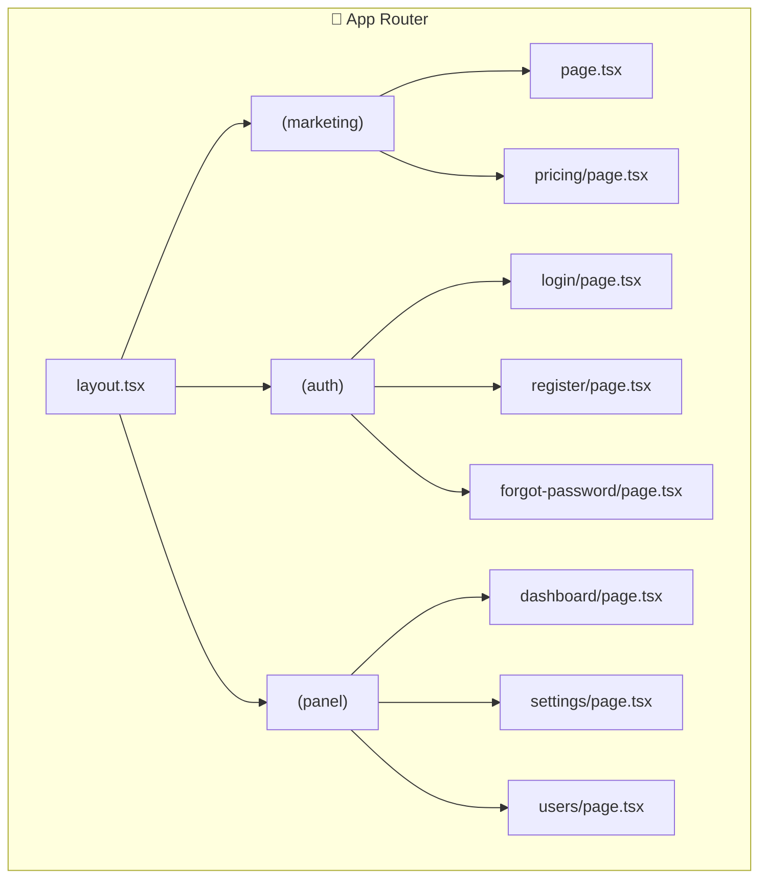

# Next.js Frontend

TurboStack uses **Next.js 16** with the App Router for a modern, performant frontend.

<Frame caption="Next.js App Router Architecture">

</Frame>

---

## Key Features

<CardGroup cols={2}>
  <Card title="App Router" icon="folder-tree">
    File-based routing with layouts and nested routes
  </Card>
  <Card title="Turbopack" icon="bolt">
    Lightning-fast development builds
  </Card>
  <Card title="React 19" icon="react">
    Server Components, Actions, and latest features
  </Card>
  <Card title="TypeScript" icon="code">
    Full type safety with strict mode
  </Card>
</CardGroup>

---

## Directory Structure

```

apps/web/
├── app/
│ ├── (marketing)/ # Public pages
│ │ ├── page.tsx # Homepage
│ │ └── pricing/ # Pricing page
│ ├── (auth)/ # Auth pages (no header)
│ │ ├── login/
│ │ ├── register/
│ │ ├── forgot-password/
│ │ └── reset-password/
│ ├── (admin)/ # Protected pages
│ │ ├── dashboard/
│ │ ├── settings/
│ │ └── users/
│ ├── api/ # API routes
│ ├── context/ # React contexts
│ ├── layout.tsx # Root layout
│ └── globals.css # Global styles
├── components/
│ ├── ui/ # shadcn/ui components
│ └── ... # Custom components
├── lib/
│ ├── api.ts # API client
│ └── utils.ts # Utilities
└── hooks/ # Custom React hooks

````

---

## Route Groups

Route groups organize your pages without affecting the URL structure:

<Tabs>
  <Tab title="(marketing)" icon="globe">
    **Public pages** with full header and footer.

    ```
    /              → Homepage
    /pricing       → Pricing page
    /about         → About page
    ```

    ```tsx
    // app/(marketing)/layout.tsx
    export default function MarketingLayout({ children }) {
      return (
        <>
          <Header />
          <main>{children}</main>
          <Footer />
        </>
      );
    }
    ```
  </Tab>
  <Tab title="(auth)" icon="lock">
    **Authentication pages** with minimal layout.

    ```
    /login         → Login page
    /register      → Registration
    /forgot-password → Password reset request
    ```

    ```tsx
    // app/(auth)/layout.tsx
    export default function AuthLayout({ children }) {
      return (
        <div className="min-h-screen flex items-center justify-center">
          {children}
        </div>
      );
    }
    ```
  </Tab>
  <Tab title="(panel)" icon="shield">
    **Protected pages** with sidebar navigation.

    ```
    /dashboard     → Main dashboard
    /settings      → User settings
    /users         → User management (panel)
    ```

    ```tsx
    // app/(panel)/layout.tsx
    export default function AdminLayout({ children }) {
      return (
        <div className="flex">
          <Sidebar />
          <main className="flex-1">{children}</main>
        </div>
      );
    }
    ```
  </Tab>
</Tabs>

---

## Authentication

### Auth Context

The app uses React Context for client-side auth state:

```tsx
"use client";

import { useAuth } from "@/app/context/auth-context";

export function UserMenu() {
  const { user, isLoading, logout } = useAuth();

  if (isLoading) return <Skeleton />;
  if (!user) return <LoginButton />;

  return (
    <DropdownMenu>
      <DropdownMenuTrigger>
        <Avatar src={user.avatar} fallback={user.name} />
      </DropdownMenuTrigger>
      <DropdownMenuContent>
        <DropdownMenuItem onClick={() => router.push("/settings")}>
          Settings
        </DropdownMenuItem>
        <DropdownMenuItem onClick={logout}>Logout</DropdownMenuItem>
      </DropdownMenuContent>
    </DropdownMenu>
  );
}
````

### Server-Side Session

Check authentication in Server Components:

```tsx
// app/(panel)/dashboard/page.tsx
import { getSession } from "@/lib/auth-server";
import { redirect } from "next/navigation";

export default async function DashboardPage() {
  const session = await getSession();

  if (!session) {
    redirect("/login");
  }

  return (
    <div>
      <h1>Welcome, {session.name}!</h1>
      <p>Role: {session.role}</p>
    </div>
  );
}
```

### Protected Routes

Use the `AuthGuard` component for client-side protection:

```tsx
import { AuthGuard } from "@/components/auth-guard";

export default function SettingsPage() {
  return (
    <AuthGuard requireEmailVerified>
      <SettingsForm />
    </AuthGuard>
  );
}
```

<Info>
  `AuthGuard` supports options like `requireEmailVerified` and `allowedRoles=
  {["ADMIN"]}` for fine-grained access control.
</Info>

---

## Environment Variables

<Tabs>
  <Tab title="Client-side" icon="browser">
    Prefix with `NEXT_PUBLIC_` to expose to browser:

    ```bash
    NEXT_PUBLIC_API_URL=http://localhost:4101
    NEXT_PUBLIC_APP_NAME=TurboStack
    ```

    ```tsx
    const apiUrl = process.env.NEXT_PUBLIC_API_URL;
    ```

  </Tab>
  <Tab title="Server-side" icon="server">
    Regular env vars are only available on server:

    ```bash
    JWT_SECRET=your-secret-key
    SESSION_SECRET=another-secret
    ```

    ```tsx
    // Only works in Server Components or API routes
    const secret = process.env.JWT_SECRET;
    ```

  </Tab>
</Tabs>

---

## Adding New Pages

<Steps>
  <Step title="Create the Page File">
    ```tsx
    // app/(marketing)/features/page.tsx
    export default function FeaturesPage() {
      return (
        <div className="container mx-auto py-12">
          <h1 className="text-4xl font-bold">Features</h1>
          <p>Discover what TurboStack offers.</p>
        </div>
      );
    }
    ```
  </Step>
  <Step title="Add Metadata (Optional)">
    ```tsx
    import type { Metadata } from "next";

    export const metadata: Metadata = {
      title: "Features | TurboStack",
      description: "Explore TurboStack features",
    };
    ```

  </Step>
  <Step title="Update Navigation">
    Add link to your header/sidebar navigation.
  </Step>
</Steps>

---

## Development

<CardGroup cols={2}>
  <Card title="Start Frontend" icon="play">
    ```bash bun run dev:web ```
  </Card>
  <Card title="Build" icon="hammer">
    ```bash cd apps/web && bun run build ```
  </Card>
</CardGroup>

The web app runs on [http://localhost:4100](http://localhost:4100).

<Tip>
  Use Server Actions for mutations and client-side fetching with `useAuth`
  context for queries to leverage Next.js optimizations.
</Tip>
